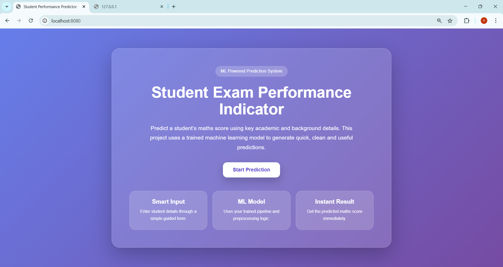
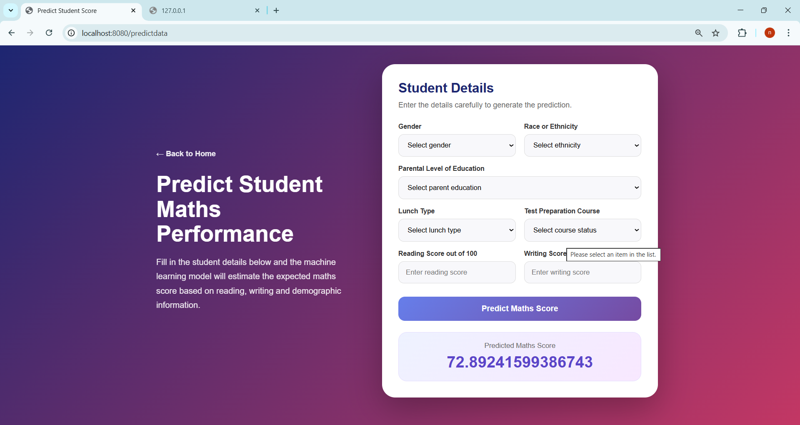

# 🎓 Student Exam Performance Indicator

A machine learning-based web application that predicts a student's **maths score** based on academic and demographic inputs.

---

## 📌 Project Overview

This project builds an end-to-end machine learning pipeline to predict student performance using:

- Gender  
- Ethnicity  
- Parental education level  
- Lunch type  
- Test preparation course  
- Reading score  
- Writing score  

The trained model is deployed using a Flask web application for real-time predictions.

---

## 🖼️ Application Screenshots

### Home Page

### Prediction Page

---

## ⚙️ How It Works

### Data Processing
- Data cleaning and preprocessing  
- Encoding categorical variables  
- Feature scaling  

### Model Training
The following regression models were trained and compared:

- Random Forest Regressor  
- Decision Tree Regressor  
- Gradient Boosting Regressor  
- Linear Regression  
- XGBoost Regressor  
- CatBoost Regressor  
- AdaBoost Regressor  

### Final Model
- Best model selected based on performance  
- Saved as `model.pkl`  
- Preprocessing saved as `preprocessor.pkl`  

---

## 🧠 Prediction Pipeline

- Accepts user input from UI  
- Converts input into dataframe  
- Applies preprocessing  
- Generates prediction using trained model  

---

## 🚀 How to Run the Project

### 1. Clone Repository
git clone https://github.com/namitjain123/mlprojects.git  
cd mlprojects  

---

### 2. Create Virtual Environment
python -m venv venv  
.\venv\Scripts\activate  

---

### 3. Install Dependencies
pip install -r requirements.txt  

---

### 4. Run Application
python app.py  

---

### 5. Open in Browser
http://localhost:8080  

---

## 🛠️ Tech Stack

- Python  
- Pandas, NumPy  
- Scikit-learn  
- XGBoost, CatBoost  
- Flask  
- HTML, CSS  

---

## 🎯 Features

- Clean UI interface  
- Real-time prediction  
- End-to-end ML pipeline  
- Multiple model comparison  

---

## 📌 Future Improvements

- Improve model accuracy with tuning  
- Add charts and visualization  
- Deploy with CI/CD  
- Add authentication  

---

## 👨‍💻 Author

**Namit Jain**  
Master of Data Science – Deakin University  

---

## ⭐ Notes

- This is an educational project  
- Designed for learning ML + deployment  